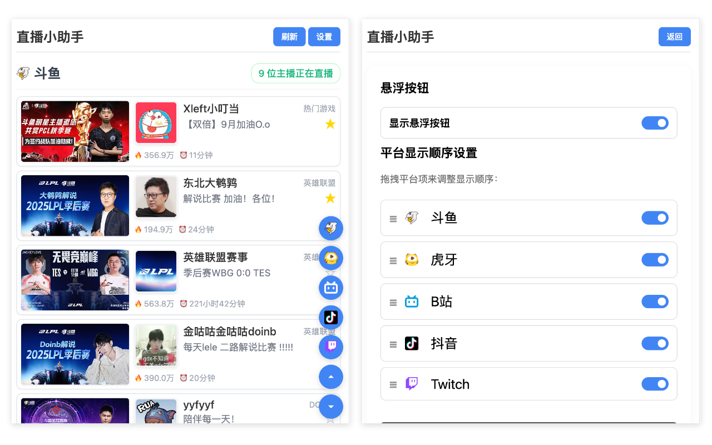

# Live Assistant

[中文](README.md)

A Chrome extension that integrates follow lists from multiple live streaming platforms, allowing you to view all your followed streamers' live status in one place.



## 🌟 Features

- ✅ Support multiple popular live streaming platforms: Douyu, Huya, Bilibili, Douyin, Twitch
- ✅ Real-time display of streamer live status and viewer counts
- ✅ One-click jump to streamer live rooms
- ✅ Customizable platform display order
- ✅ Dark mode support
- ✅ Local data caching for improved performance
- ✅ Responsive design for different screen sizes

## 📦 Supported Platforms

| Platform | Status | Notes |
|----------|--------|-------|
| Douyu | ✅ Full Support | Includes streamer info and heat |
| Huya | ✅ Full Support | Includes streamer info and heat |
| Bilibili | ✅ Full Support | Includes streamer info and viewer count |
| Douyin | ❌ Not yet | - |
| Twitch | ❌ Not yet | - |

## 🚀 Installation

### Method 1: Install from Chrome Web Store (Recommended)

1. Visit [Chrome Web Store](https://chrome.google.com/webstore/detail/live-assistant/your-extension-id)
2. Click "Add to Chrome"
3. After installation, find the extension icon in your browser toolbar

### Method 2: Manual Installation

1. Download or clone this repository
2. Open Chrome browser and visit `chrome://extensions/`
3. Enable "Developer mode" in the top right corner
4. Click "Load unpacked extension"
5. Select the project root directory

## 🔧 Usage

1. Click the extension icon in your browser toolbar to open Live Assistant
2. The extension will automatically load follow lists from all platforms
3. View streamers who are currently live
4. Click on streamer cards to jump directly to their live room
5. Click "Settings" to customize platform display order

## 📁 Project Structure

```
stream-helper/
├── src/
│   ├── background.js     # Background service script
│   ├── content.js        # Content script
│   ├── popup.html        # Popup interface HTML
│   └── popup.js          # Popup interaction logic
├── icon.png              # Extension icon
├── manifest.json         # Extension configuration
├── README.md             # Chinese documentation
├── README.en.md          # English documentation
└── LICENSE               # License file
```

## 🛠️ Technology Stack

- **JavaScript ES6+** - Core logic implementation
- **Chrome Extension API** - Browser extension functionality
- **HTML/CSS** - User interface
- **Manifest V3** - Extension version specification

## ⚠️ Notes

1. **Login Required**: You need to log in to each streaming platform to get follow lists
2. **API Limitations**: Some platform APIs may have limitations affecting data retrieval
3. **Privacy Protection**: Extension only reads necessary cookies for authentication
4. **Performance Optimization**: Uses local caching to reduce repeated requests

## 🤝 Contribution Guide

We welcome contributions to improve this project!

1. Fork the project
2. Create your feature branch (`git checkout -b feature/AmazingFeature`)
3. Commit your changes (`git commit -m 'Add some AmazingFeature'`)
4. Push to the branch (`git push origin feature/AmazingFeature`)
5. Open a Pull Request

## 📄 License

This project is licensed under the GPLv3 License - see the [LICENSE](LICENSE) file for details.

## 👨‍💻 Developer

**Licardo** - [GitHub](https://github.com/l1cardo)

## 🙏 Acknowledgments

Thank you to all developers and users who contribute to this project!

---

*If you find this project useful, please give it a Star!*
