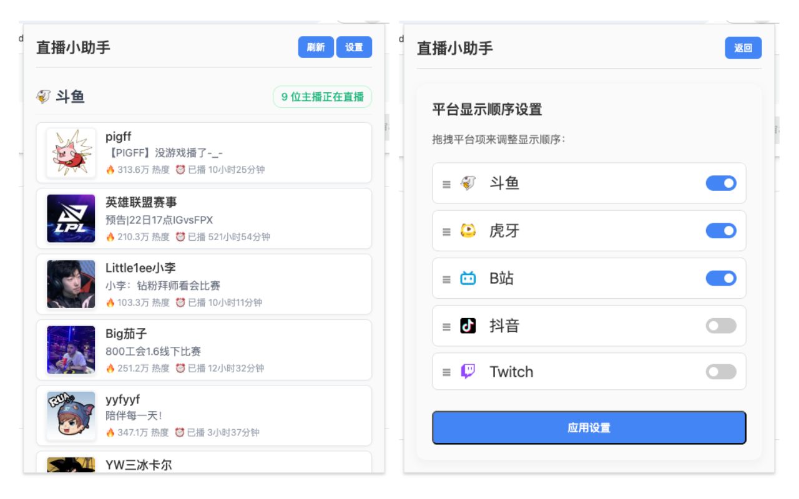

# 直播小助手 (Live Assistant)

[English](README.en.md)

一款Chrome浏览器扩展，用于整合多个直播平台的关注列表，让您一站式查看所有关注主播的直播状态。



## 🌟 功能特性

- ✅ 支持多个主流直播平台：斗鱼、虎牙、B站、抖音、Twitch
- ✅ 实时显示主播直播状态和观看人数
- ✅ 一键跳转到主播直播间
- ✅ 自定义平台显示顺序
- ✅ 支持暗黑模式
- ✅ 本地数据缓存，提升访问速度
- ✅ 响应式设计，适配不同屏幕尺寸

## 📦 支持的平台

| 平台 | 状态 |
|------|------|
| 斗鱼 | ✅ 完全支持 |
| 虎牙 | ✅ 完全支持 |
| B站 | ✅ 完全支持 |
| 抖音 | ✅ 完全支持 |
| Twitch | ✅ 完全支持 |

## 🚀 安装说明

### 方法一：从Chrome Web Store安装（推荐）

1. 访问 [Chrome Web Store](https://chromewebstore.google.com/detail/gapakkgfjmmbdgaabgedecdhnpheboln) 或者 [Edge Addons Store](https://microsoftedge.microsoft.com/addons/detail/iccpkamhcodiboccdihoimjaeoooflhk)
2. 点击"添加至浏览器"
3. 安装完成后，在浏览器工具栏找到扩展图标

### 方法二：手动安装

1. 下载或克隆此仓库
2. 打开Chrome浏览器，访问 `chrome://extensions/`
3. 开启右上角的"开发者模式"
4. 点击"加载已解压的扩展程序"
5. 选择项目根目录文件夹

## 🔧 使用方法

1. 点击浏览器工具栏中的扩展图标打开直播小助手
2. 系统会自动加载各个平台的关注列表
3. 查看各平台正在直播的主播
4. 点击主播卡片可直接跳转到直播间
5. 点击"设置"可自定义平台显示顺序

## 📁 项目结构

```
stream-helper/
├── src/
│   ├── background.js     # 后台服务脚本
│   ├── content.js        # 内容脚本
│   ├── popup.html        # 弹窗界面HTML
│   └── popup.js          # 弹窗交互逻辑
├── icon.png              # 扩展图标
├── manifest.json         # 扩展配置文件
├── README.md             # 项目说明文档
└── LICENSE               # 许可证文件
```

## 🛠️ 技术栈

- **JavaScript ES6+** - 核心逻辑实现
- **Chrome Extension API** - 浏览器扩展功能
- **HTML/CSS** - 用户界面
- **Manifest V3** - 扩展版本规范

## ⚠️ 注意事项

1. **登录要求**：需要在各个直播平台登录账号才能获取关注列表
2. **API限制**：部分平台API可能有限制，导致数据获取不稳定
3. **隐私保护**：扩展仅读取必要的Cookie信息用于认证
4. **性能优化**：使用本地缓存减少重复请求

## 🤝 贡献指南

欢迎提交Issue和Pull Request来帮助改进这个项目！

1. Fork 本项目
2. 创建你的特性分支 (`git checkout -b feature/AmazingFeature`)
3. 提交你的更改 (`git commit -m 'Add some AmazingFeature'`)
4. 推送到分支 (`git push origin feature/AmazingFeature`)
5. 开启 Pull Request

## 📄 许可证

本项目采用 GPLv3 许可证 - 查看 [LICENSE](LICENSE) 文件了解详情。

## 👨‍💻 开发者

**Licardo** - [GitHub](https://github.com/l1cardo)

## 🙏 致谢

感谢所有为本项目做出贡献的开发者和用户！

---

*如果你觉得这个项目有用，请给个Star！*
